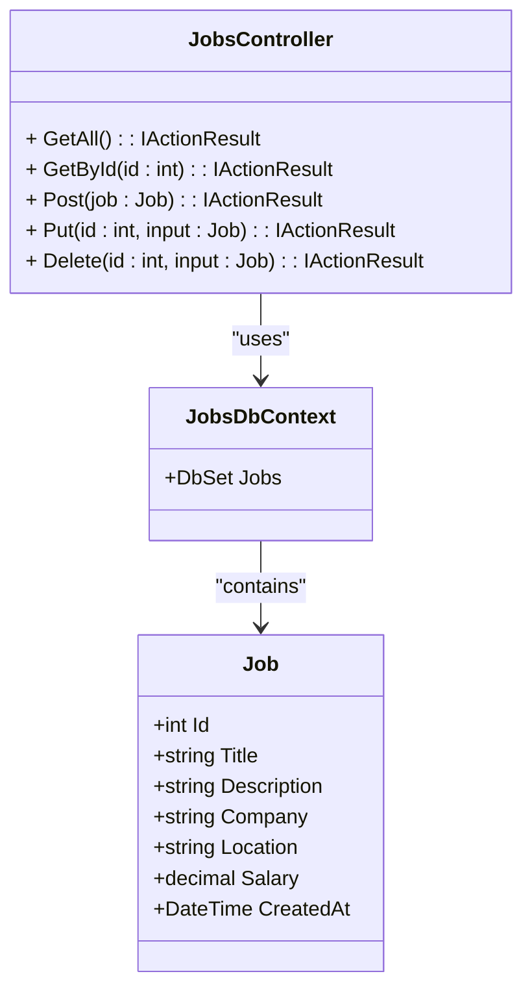

 📘 # Jobs-Api

An **ASP.NET** Core REST API ( ** in development ** ) for managing job postings (jobs).  
Allows you to **list**, **create**, **update** and **delete** vacancy records stored in a **SQL Server database**.

---

## 🧩 Technologies used

- **.NET 8 / ASP.NET Core Web API**
- **Entity Framework Core**
- **SQL Server**
- **Swagger / Swashbuckle**
- **Visual Studio / VS Code**

---

## 📂 Project structure

```plaintext
JobsApi/
│
├── Controllers/
│ └── JobsController.cs
│
├── Models/
│ └── Job.cs
│
├── Data/
│ └── JobsDbContext.cs
│
├── Program.cs
├── appsettings.json
└── README.md

```

---

## 🧠 Description of classes

### 🔹 Job.cs
Representa a entidade principal da aplicação.

| Propriedade   | Tipo       | Descrição                             |
|----------------|------------|--------------------------------------|
| Id             | int        | Unique Job Identifier.               |
| Title          | string     | Job title.                           |
| Description    | string     | Detailed description of the vacancy. |
| Company        | string     | Name of the contracting company.     |
| Location       | string     | Vacancy location.                    |
| Salary         | decimal    | Salary range offered.                |
| CreatedAt      | DateTime   | Record creation date.                |

---

### 🔹 JobsDbContext.cs
Classe responsável pela comunicação com o banco de dados via Entity Framework Core.

```csharp
public class JobsDbContext : DbContext
{
    public JobsDbContext(DbContextOptions<JobsDbContext> options)
        : base(options) { }

    public DbSet<Job> Jobs { get; set; }

 protected override void OnModelCreating(ModelBuilder builder)
        {
            // If you want to configure the Job entity, use modelBuilder.Entity<Job>()
            
            builder.Entity<Job>(o => 
            {
                o.HasKey(j => j.Id);
            });
        }
}
```
---
## 📊 UML Diagram


---
## ⚙️ How to run the project

### 1️⃣ Prerequisites
- [.NET SDK 8.0+](https://dotnet.microsoft.com/en-us/download)
- [SQL Server](https://www.microsoft.com/pt-br/sql-server/sql-server-downloads)
- [Visual Studio 2022](https://visualstudio.microsoft.com/) ou VS Code

### 2️⃣ Clone the repository
```bash
git clone https://github.com/Fabiovgc/Jobs-Api.git
cd jobs-api
```

### 3️⃣ Configure the database connection

In the appsettings.json file, change the connection string **according to your authentication**:
> for **Sql Server authentication**
```csharp

"ConnectionStrings": {
  "DefaultConnection": "Server=<your-server-address>;Database=<database-name>;User Id=<your-database-user-name>;Password=<your-database-password>;"
}
```
> or for **Windows authentication**
```csharp
"ConnectionStrings": {
  "DefaultConnection": "Server=localhost\\SQLEXPRESS;Database=JobsDb;Trusted_Connection=True;TrustServerCertificate=True;"
}
```

### 4️⃣ Apply migrations and create the database
```bash
dotnet ef database update
```

### 5️⃣ Run the project
```bash
dotnet run
```
---
## 🧪 JSON example for testing

### Example of body for creating a Job (POST)
```json
{
  "title": "Backend Software Engnineer",
  "description": "Responsible for building and maintaining logic, data structure, and server operations",
  "company": "Tech Solutions",
  "location": "São Paulo, SP",
  "salary": 5500.00,
  "createdAt": "2025-10-17T00:00:00"
}
```
---

## 🧾 Main settings

Check that in `Program.cs` there is:

```csharp
var connectionString = builder.Configuration.GetConnectionString("name-of-your-connectionstring");
builder.Services.AddDbContext<name-of-your-DbContext-class>(
    o => o.UseSqlServer(connectionString));


var app = builder.Build();

if (app.Environment.IsDevelopment())
{
    app.UseSwagger();
    app.UseSwaggerUI();
    app.UseExceptionHandler("/Home/Error");
    app.UseHsts();
}
```
Check that in `launchSettings.json` there is:

```csharp
"https": {
  "commandName": "Project",
  "launchBrowser": true,
  "environmentVariables": {
    "ASPNETCORE_ENVIRONMENT": "Development"
  },
  "dotnetRunMessages": true,
  "applicationUrl": "https://localhost:5001;http://localhost:5287"
}
```

With this, the interactive documentation will automatically be available at:
```
https://localhost:5001/swagger/index.html
```
